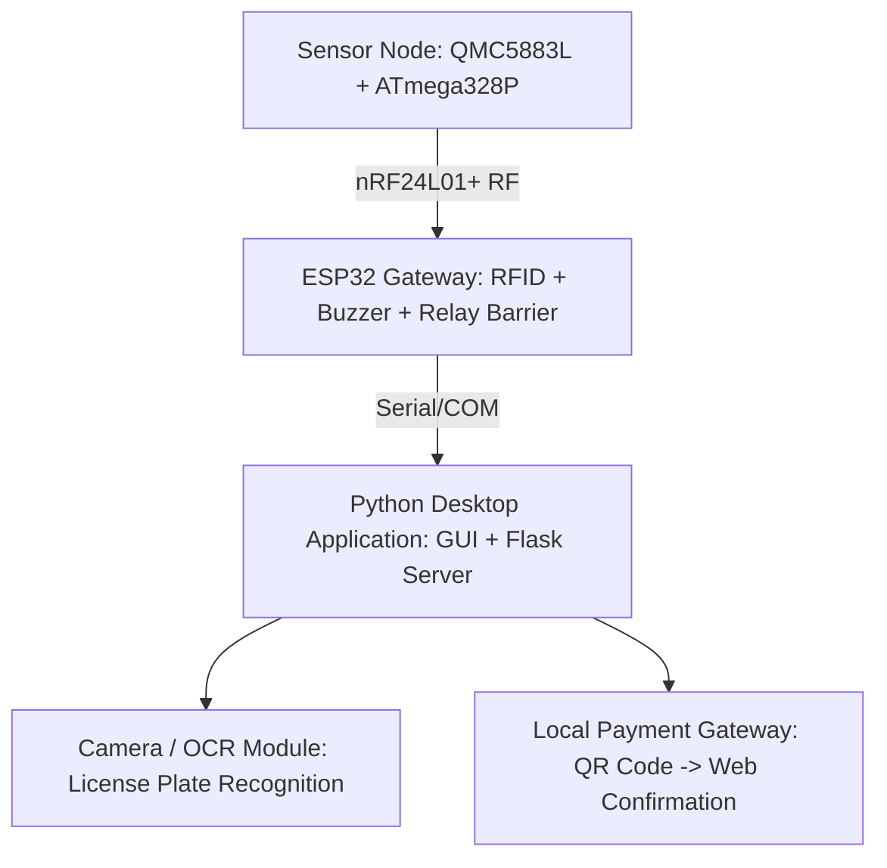

# 🚗 Smart Parking Management System

Hệ thống quản lý bãi đỗ xe thông minh tự động (Smart Parking & Barrier Access System) tích hợp cảm biến từ trường, nhận diện biển số (ANPR/ALPR), cổng thanh toán QR cục bộ và cơ cấu điều khiển barrier tự động.

---

## 👥 Phân Công Nhiệm Vụ (Team Members & Roles)

| Thành viên | Trách nhiệm chính | Chi tiết công việc |
| :--- | :--- | :--- |
| **Tri** | **Nhận diện biển số (ANPR/ALPR)** | - Xây dựng module trích xuất ảnh và nhận diện biển số xe qua camera / OpenCV.<br>- Tích hợp tiền xử lý hình ảnh và thuật toán OCR để đọc ký tự biển số. |
| **Kiên** | **Ứng dụng Python & Tích hợp** | - Phát triển giao diện Desktop App Dashboard (Tkinter / CustomTkinter).<br>- Tích hợp giao tiếp Serial/UART (pyserial) với ESP32.<br>- Xây dựng Web Server cục bộ (Flask) xử lý luồng thanh toán QR & quản lý phiên đỗ xe (Active Permits). |
| **Long** | **Firmware & Phần cứng** | - Thiết kế mạch, kết nối phần cứng vi điều khiển (ATmega328P, ESP32).<br>- Lập trình giao tiếp không dây nRF24L01+ giữa các node cảm biến và ESP32 Gateway.<br>- Xử lý cảm biến từ trường QMC5883L, điều khiển còi báo (Buzzer/Beep), RFID và đóng/mở Barrier (Relay/Servo). |

---

## 🏗️ Kiến Trúc Hệ Thống (System Architecture)



Sơ đồ khối minh họa các kết nối chính giữa cảm biến từ trường, vi điều khiển, module RF, ESP32 Gateway, và phần mềm Desktop Application.

---

## 🚀 Tính Năng Hệ Thống (Features)

### 1. 🔍 Tính năng phần cứng & Firmware (Long)
- **Node cảm biến đỗ xe**: Sử dụng cảm biến từ trường QMC5883L kết hợp ATmega328P phát hiện xe vào/ra từng ô và truyền dữ liệu qua module nRF24L01+.
- **Gateway ESP32**: Thu thập trạng thái từ các node RF, đọc thẻ RFID xác thực, còi báo hiệu (beep) và điều khiển cơ cấu Relay/Servo đóng/mở Barrier.
- **Giao tiếp hai chiều**: Nhận dữ liệu trạng thái ô đỗ từ ESP32 gửi lên PC và nhận lệnh điều khiển mở barrier từ PC/Server gửi xuống.

### 2. 📷 Nhận diện Biển số xe (Tri)
- Thu nhận luồng hình ảnh từ camera trạm vào/ra.
- Trích xuất vùng biển số xe và phân tích ký tự (hỗ trợ cả camera thực tế và chế độ giả lập biển số ngẫu nhiên phục vụ kiểm thử).

### 3. 💻 Ứng dụng Desktop & Cổng Thanh toán Local (Kiên)
- **Bảng điều khiển trực quan**: Hiển thị trạng thái các ô đỗ xe (Trống / Có xe) theo thời gian thực.
- **Tạo mã QR thanh toán**: Tạo mã QR chứa URL Web Server nội bộ (`http://<LAN-IP>:5000/pay/...`) để người dùng quét bằng điện thoại trên cùng mạng LAN.
- **Bảng quản lý đỗ xe (Active Permits)**: Bảng đếm ngược thời gian đỗ xe thực tế theo định dạng `HH:MM:SS` ngay khi thanh toán thành công và tự động giải phóng khi hết hạn.
- **Chế độ mô phỏng (Simulation Mode)**: Hỗ trợ kiểm thử toàn bộ luồng hệ thống mà không cần phần cứng kết nối.

---

## 📂 Cấu Trúc Thư Mục Dự Án (Project Structure)

```text
Car_Parking/
├── app/
│   ├── parking_app.py         # Ứng dụng chính (Giao diện Tkinter + Luồng xử lý Serial & Queue)
│   ├── server.py              # Web server thanh toán local (Flask)
│   ├── plate_recognizer.py    # Module xử lý nhận diện biển số (OpenCV)
│   ├── requirements.txt       # Danh sách thư viện Python cần thiết
│   └── venv/                  # Môi trường ảo Python (được ignore)
├── codetest/
│   ├── RFtest/                # Code test truyền nhận nRF24L01+
│   ├── magnetometer/          # Code test cảm biến từ trường QMC5883L
│   └── index.html             # Bản mock UI web
├── Datasheets/                # Tài liệu kỹ thuật linh kiện (QMC5883L, nRF24L01+, ATmega,...)
├── .gitignore
└── README.md
```

---

## 🛠️ Hướng Dẫn Cài Đặt & Chạy Ứng Dụng (Quick Start)

### 1. Yêu cầu môi trường
- Python 3.10+
- Hệ điều hành: Windows / macOS / Linux

### 2. Cài đặt thư viện
```powershell
# Di chuyển vào thư mục ứng dụng
cd app

# Tạo và kích hoạt môi trường ảo (khuyến nghị)
python -m venv venv
.\venv\Scripts\activate

# Cài đặt các gói phụ thuộc
pip install -r requirements.txt
```

### 3. Khởi chạy Dashboard
```powershell
python parking_app.py
```

### 4. Quy trình kiểm thử (Demo Flow)
1. **Kết nối phần cứng**: Chọn cổng COM của ESP32 và nhấn **Connect** (hoặc nhấn **Start Simulation** để test không cần phần cứng).
2. **Nhận diện biển số**: Nhấn **Scan Plate** (dùng Camera) hoặc **Simulate Plate** (sinh biển số giả lập ngẫu nhiên).
3. **Tạo QR thanh toán**: Nhập số giờ đỗ xe và nhấn **Generate QR**.
4. **Thanh toán & Mở Barrier**: 
   - Dùng điện thoại cùng mạng Wi-Fi quét mã QR trên màn hình.
   - Nhấn **Confirm Payment** trên trang web.
   - Hệ thống tự động gửi lệnh mở Barrier đến ESP32 và cập nhật bảng **Active Permits** hiển thị thời gian đếm ngược `HH:MM:SS`.
